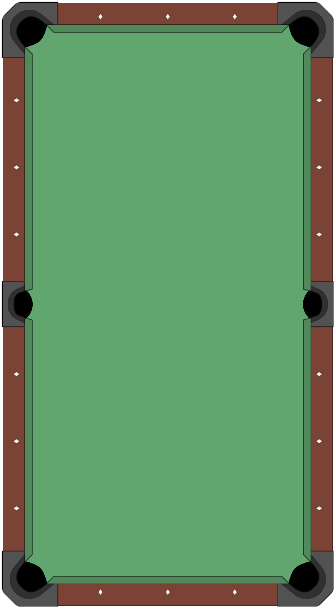

# Poolball
 To-do
 
 1. Add collision with physics theory
 2. Read paper'Macro and Micro Reinforcement Learning for Playing Nine-ball Pool' and AlphaGO?

 ------------------------------------------------------------------------
 2022/11/15
 
 
 
 - Calculate the best path by using contact position for cue ball to each hole
 - Calculate the path of cue ball after collision by using the tangentline to the target ball path. Then use mirror transfromation to calculate the cushion points and the final position of the cue ball, and the distance of this path is equal to target ball's
 - Change the background of the graphic into a complete pool ball table, the value of radius in table.py and the position of holes in main.py to prevent the situation that balls will appear on the cushion

 ------------------------------------------------------------------------
 2022/12/31

 - Add the User interface to enter position of balls with Tkinte (For multimedia presentation)
 - Extent the path of cue ball after collision to set next shot became a easy straight shot.

  ------------------------------------------------------------------------